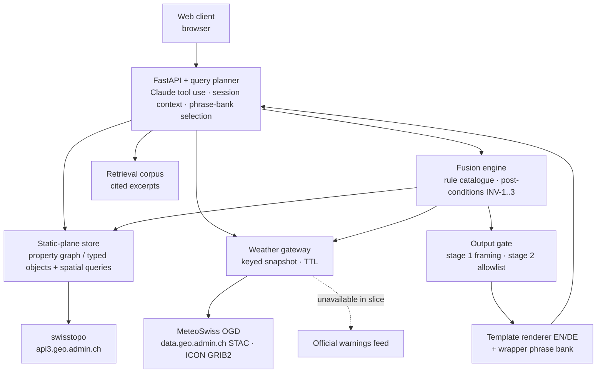
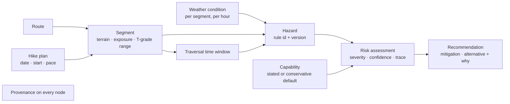

# Hiking Safety Assistant: Solution Architecture v0.2 (team map)

**Status:** For team alignment. Slice agreed 2026-09-14 after a structured grill and six rounds of adversarial review (see `PLAN-REVIEW-LOG.md`).
**Audience:** The Swiss AI Weeks hackathon team. Read this to agree what we build, how the pieces fit, and what is deliberately deferred.
**Sources of truth:** `source/hiking-safety-assistant-requirements.md` (requirement IDs), `CONTEXT.md` (glossary; terms in bold below are defined there), `source/hiking-safety-assistant-competitor-matrix.xlsx` (market claims).

---

## 1. What we are building, in one paragraph

A decision-support assistant that fuses swisstopo route and terrain data with MeteoSwiss forecasts into segment-level, time-aware hazard and risk assessments for a planned Swiss hike, with every fact carrying provenance and every response framed to avoid false reassurance. The differentiator is a **deterministic** risk-fusion layer: terrain × weather × time per route segment, explained through reviewed templates, never through free LLM prose. The LLM plans the query and frames the conversation. It does not reason about risk and it does not write facts. Determinism is the safety feature.

## 2. The vertical slice

**In the slice**

| Item | Decision |
|---|---|
| Moments | Pre-hike planning, and risk identification with alternatives |
| Client | Web only (server-rendered page) |
| Route input | Route by name, or start and end points, resolved on the official swisstopo hiking network |
| Weather | MeteoSwiss Open Government Data (OGD) only: ICON-CH1-EPS (33 h horizon, 1 km, 3 h cycle) and ICON-CH2-EPS (120 h horizon, 2.1 km, 6 h cycle) |
| Response languages | EN and DE, each with a complete explanation-template set; place names always in their official language |
| LLM | Claude via the Anthropic API, as query planner and phrase selector only |
| Stack | Python 3.12, FastAPI, pytest |

**Designed but deferred**, one reason each

| Item | Reason |
|---|---|
| In-situ moment, phone and watch clients, offline snapshot | Second and third client surfaces; the static/live split is designed to support them later (§10) |
| GPX upload, drawn tracks, region search | Extra ingestion path; documented future path is direct segmentation without map-matching |
| meteoblue | Outside the open-data constraint (DR-1); licence and API-key dependency |
| FR and IT response languages | Template authoring and review load; NFR-5 partial |
| Official warnings feed | No stable documented public JSON feed for aggregated MeteoSwiss or natural-hazard warnings was found in September 2026; see §7 for how the slice behaves without one |
| Off-grid comms, active SOS | Out of scope (requirements); liability, hardware dependency. We point to 1414 / 112 and never initiate contact |

## 3. Principles (unchanged from v0.1, now enforced)

1. **Separate the static plane from the live plane.** Geospatial facts persist; weather is never persisted as a durable fact, only held as a keyed **weather snapshot** with a TTL.
2. **The risk layer is first-class.** Hazard and risk assessment are entities with inputs and a reasoning trace.
3. **Every fact carries provenance.** Source facts: source, timestamp, confidence, freshness. Derived facts: input fact IDs, **hazard rule** ID and version, computed confidence.
4. **Timing is spatiotemporal.** Conditions attach to a segment at its expected traversal window.
5. **Fail safe, never falsely reassure.** Encoded as seven testable invariants (§7).
6. **No factual sentence is LLM-generated.** New in v0.2. Facts reach the user only as **rendered sentences** from templates or as **cited excerpts**.

## 4. System context

Clients never touch data sources. The planner decomposes a question into tool calls; the fusion engine and output gate produce every fact the user sees.

## 5. Domain spine

Four planes: static (routes, segments, terrain, POIs, T1-T6 scale, guidance corpus), live (forecasts, conditions, warnings), derived (hazards, assessments, recommendations), context (hiker, capability, party, plan). The value is the derived plane: a spatiotemporal join across static and live, evaluated against the hiker.

## 6. Components

### 6.1 Query planner (LLM boundary)
- **Model:** `claude-opus-5`, adaptive thinking, strict tool schemas.
- **Permitted roles:** decompose the question, keep multi-turn session context scoped to a hike plan (FR-12), choose tools (resolve route, assess, alternatives, corpus lookup), select which retrieved passages to show, and assemble the **conversational wrapper** by selecting identifiers from an approved, slot-free **phrase bank**.
- **Forbidden:** writing any factual sentence, translating templates or excerpts, introducing a hazard, condition, or value.
- **Evaluation (AIQ):** offline sampling of decomposition correctness, passage relevance, and wrapper appropriateness. Measurement, not enforcement.

### 6.2 Static-plane store and retrieval
- OWL is the **design-time** vocabulary for the static plane and provenance model. Runtime storage is a property graph or typed objects with spatial queries. GeoSPARQL and SHACL are not runtime capabilities.
- Routes and segments are precomputed for official-network routes. Route attributes and their sources are a **verify-first** table (§11).
- The retrieval corpus (hiking-scale definitions, hut information, safety guidance) is served as verbatim **cited excerpts** with source and retrieval timestamp. Live weather is never in the corpus.

### 6.3 Weather gateway
- Fetches ICON-CH1-EPS for hikes inside 33 h, ICON-CH2-EPS beyond, from the STAC collections `ch.meteoschweiz.ogd-forecasting-icon-ch1` / `-ch2` on data.geo.admin.ch; GRIB2 decoded server-side; nearest-cell values per segment centroid per traversal hour.
- Holds a **weather snapshot** keyed by route, hike date, and forecast window, with a TTL. Any change to route, date, start time, or pace invalidates it and triggers a fresh fetch and full reassessment. Each alternative candidate route gets its own snapshot.
- Confidence inputs: forecast lead time, ensemble spread where available, data age, warning level (when a feed exists).

### 6.4 Fusion engine
- Applies the **hazard rule catalogue** per segment and traversal window. Each rule: ID, version, required inputs, condition, severity, one-line justification, cited basis (SAC guidance, MeteoSwiss criteria), and one explanation template per enabled language.
- A rule whose required input is missing does not fire and records **not evaluated** for that segment.
- Aggregates hazards into a risk assessment with severity, confidence, and a reasoning trace generated from derived provenance.
- Enforces structural invariants INV-1..3 as **fusion post-conditions** (§7).
- **Mitigations first, then alternatives** (§8).

### 6.5 Output gate and rendering
- **Stage 1** (before rendering, on the structured assessment): INV-4 stale-forecast confidence cap and label; INV-5 cautionary framing when confidence is low.
- **Template renderer:** every hazard, severity statement, recommendation, mitigation, alternative, assessment outcome, and route attribute becomes a **rendered sentence** from its template, EN or DE.
- **Stage 2** (on the assembled wrapper): every wrapper sentence must resolve to a phrase-bank identifier; anything else is rejected, not hedged. INV-6 and INV-7 are checked here. The phrase bank is reviewed against safe/go verdict patterns and the controlled safety vocabulary whenever it changes.
- **Template coverage is a per-language release gate.** A language is enabled only when every rule and rendered attribute has a reviewed template. At runtime an unrenderable safety object falls back to the EN block with a notice; with no template anywhere the outcome is **not assessable**. A detected hazard is never dropped for lack of a template.
- **Streaming:** the structured assessment renders first (target about 5 s), then excerpts and wrapper follow as blocks.

## 7. Safety invariants

| ID | Invariant | Enforced in | On failure | Requirement |
|---|---|---|---|---|
| INV-1 | A recommendation links to the hazard or assessment that justifies it | Fusion post-condition | Recommendation dropped | FR-11 |
| INV-2 | An official warning outranks any derived hazard in its category; the authority is surfaced, not the inference | Fusion post-condition | Derived hazard subordinated | SR-2 |
| INV-3 | A risk assessment cannot exist without linked evidence for each hazard | Fusion post-condition | Assessment not produced; outcome **not assessable** | NFR-3, DR-4 |
| INV-4 | A condition whose forecast is older than the freshness threshold is flagged stale and lowers confidence | Output gate stage 1 | Confidence capped, stale label | NFR-2 |
| INV-5 | Low confidence forces cautionary framing; absence of a known hazard is never evidence of safety | Stage 1 sets framing; phrase bank and templates reviewed against it | Cautionary framing forced | SR-3, NFR-1 |
| INV-6 | No definitive safe/go verdict is emitted | Stage 2 allowlist; phrase-bank review | Non-allowlisted wrapper rejected | SR-4 |
| INV-7 | Disclaimer and pointer to official channels present in every assessment response | Stage 2 | Response held until the disclaimer block is attached | SR-1, SR-2 |

Each invariant is a unit test named by its ID.

**Warnings in the slice.** With no stable public warnings feed, the warnings adapter reports **unavailable**. INV-2 then has nothing to subordinate to, so the response says official warnings could not be checked and points to MeteoSwiss and the avalanche bulletin explicitly. This is a disclosed gap, not a silent one (DR-3).

## 8. Assessment outcomes, degraded data, mitigations, alternatives

**Assessment outcome** is decided by rule-evaluation coverage, with precedence:
1. **Not assessable:** weather source unavailable, route unresolved, or INV-3 failed. Reason stated, official channels named, no hazards or recommendations shown.
2. **Partially assessed:** route resolved and weather obtained, but at least one applicable rule on at least one segment could not be evaluated. Affected segments and missing inputs listed as *not evaluated*; recommendations depending on them suppressed.
3. **Assessed:** every applicable rule evaluated on every segment. An empty hazard list is meaningful only here.

Missing hiker context (FR-9) uses a conservative default capability, disclosed as assumed, and stays *assessed*. Unknown route attributes that no rule consumes go to a separate "route information not available" list and never count as absent or safe.

**Mitigations first.** When any hazard is at or above the severity threshold, fusion re-runs with a shifted start time and, separately, a turnaround before the triggering segment. A mitigation is offered only if the re-run removes or lowers the triggering hazard without adding an equal or higher one.

**Then alternatives.** Up to N official-network candidates sharing the start or within a bounded radius. Eligibility limit **L** = the plan's grade upper bound (exact grade, or the trail-category range T1 / T2-T3 / T4-T6), lowered to the stated capability if given. Unknown plan grade withholds automatic proposals; unknown candidate grade is never auto-proposed. Each eligible candidate gets its own traversal plan and weather snapshot and is assessed independently. Proposed only if it removes or lowers the triggering hazard without adding an equal or higher one. If nothing qualifies, the response says so and points to official channels.

## 9. Latency (NFR-4)

Structured assessment within about 5 seconds, rendered immediately. Excerpts and wrapper follow as blocks. Weather snapshot reuse across follow-ups while key and TTL hold. Connectivity tolerance is deferred with the in-situ moment.

## 10. Deferred design: in-situ and thin clients

The web tier stays the source of truth. When built, a phone client receives a **materialised offline snapshot**: a bounded, timestamped bundle (route and terrain subset, forecast snapshot with valid-until, precomputed assessment and recommendations). Devices hold conclusions, not the graph, and perform no inference. As the bundle ages past its validity the client degrades to caution. R-1 closes as read-only when built. KAD-4 and KAD-5: accepted, deferred.

## 11. Verify-first table: route attributes and sources

| Attribute | Candidate dataset | Status | Outcome when absent |
|---|---|---|---|
| Route name resolution | SwitzerlandMobility hiking routes via geo.admin.ch (`ch.astra.wanderland`) | To verify | Route unresolved: not assessable |
| Start/end routing on network | swissTLM3D hiking trails (`ch.swisstopo.swisstlm3d-wanderwege`) | To verify | Route unresolved: not assessable |
| Elevation profile | api3.geo.admin.ch profile service | To verify | Segments by distance only; elevation rules not evaluated |
| T-grade per route | SAC route grade where published; otherwise trail category yields a range | To verify | Show range, mark exact grade unknown; FR-3 partial |
| Exposure, technical sections | swissTLM3D attributes | To verify | Not evaluated per segment |
| Huts, water, bail-out points | swisstopo POI layers | To verify | Listed as not available |
| Forecast variables (T, precip, gust, cloud, CAPE, freezing level) | ICON-CH1/CH2 GRIB2 parameter list ("work in progress" in MeteoSwiss docs) | To verify | Rule not evaluated |
| Official warnings | None found (September 2026) | Unavailable | Disclosed; INV-2 inert |

## 12. Key architectural decisions

| ID | Decision | Status |
|---|---|---|
| KAD-1 | Static plane persisted; live data never persisted as a durable fact, only as a keyed weather snapshot with TTL | Accepted |
| KAD-2 | OWL as design-time vocabulary; property graph or typed objects with spatial queries at runtime (merges former KAD-6) | Accepted |
| KAD-3 | Risk fusion in a deterministic engine with a versioned rule catalogue, not an OWL reasoner and not the LLM | Accepted |
| KAD-4 | Devices hold conclusions, not the graph | Accepted, deferred |
| KAD-5 | Materialised offline snapshot with fail-safe aging | Accepted, deferred |
| KAD-7 | Invariants are executable code: fusion post-conditions and a two-stage output gate | Accepted |
| KAD-8 | No factual sentence is LLM-generated; templates and cited excerpts carry all facts; wrapper is an allowlisted phrase bank | Accepted |
| KAD-9 | MeteoSwiss OGD is the sole weather source | Accepted |
| KAD-10 | Route input limited to the official network by name or start/end | Accepted |

## 13. Risks and open items

| ID | Item | Disposition |
|---|---|---|
| R-1 | Offline read-only vs recompute | Closed: read-only when built |
| R-2 | OWL runtime weight | Closed by KAD-2 |
| R-3 | Off-grid comms and SOS | Closed: out of scope |
| R-4 | Source coverage bounds answerable questions | Open, handled by assessment outcomes (§8) |
| R-5 | False reassurance weakened for a demo | Open, non-negotiable; enforced by INV-5..7 |
| R-6 | No public official-warnings feed | Open; disclosed unavailable in slice; watch MeteoSwiss API roadmap |
| R-7 | GRIB2 decoding and nearest-cell extraction from the ICON icosahedral grid is real engineering | Open; first weather batch de-risks with a cropped fixture |
| R-8 | Grid cell (1 or 2 km) coarser than short alpine segments | Open; aggregate to the coarsest common cell, never interpolate |
| R-9 | Rule catalogue needs an author and review path before the demo | Open; team owner, person to be named |
| R-10 | Phrase bank too small makes responses feel canned | Open; UX risk accepted for the demo |

## 14. Traceability with slice status

| Requirement | Architecture element | Slice status |
|---|---|---|
| FR-1 | Route resolution on the official network (§6.2, §11) | Partial: name and start/end in; GPX, drawn track, region deferred |
| FR-2 | Segment terrain attributes (§11) | Partial pending verification |
| FR-3 | T-grade or range (§8, §11) | Partial while grades are ranges |
| FR-4, FR-5 | Weather gateway, ICON-CH1/CH2 (§6.3) | Partial: nowcast only if OGD exposes it; snow/avalanche stretch deferred |
| FR-6 | Segment traversal windows (§5) | In slice |
| FR-7, FR-8 | Fusion engine, reasoning trace (§6.4) | In slice |
| FR-9 | Conservative default capability (§8) | In slice |
| FR-10, FR-11 | Mitigations and alternatives (§8), INV-1 | In slice |
| FR-12 | Planner session context, per-question assembled answers (§6.1) | In slice |
| FR-13 | Provenance on rendered sentences and cited excerpts (§3, §6.5) | In slice |
| DR-1 | swisstopo and MeteoSwiss adapters (§6.2, §6.3) | In slice |
| DR-2 | Segmentation and nearest-cell join (§5, §6.3) | In slice |
| DR-3 | Assessment outcomes (§8), warnings unavailable disclosure (§7) | In slice |
| DR-4 | Source and derived provenance (§3) | In slice |
| AR-1 | Corpus excerpts; weather never in corpus (§6.2) | In slice |
| AR-2 | Planner tools (§6.1) | In slice, in-process tools; MCP wrapping optional |
| AR-3 | Planner decomposition; AIQ offline evaluation (§6.1) | In slice |
| AR-4 | KAD-8: no LLM-generated facts | In slice |
| NFR-1, NFR-2, NFR-3 | INV-1..7 (§7) | In slice |
| NFR-4 | Staged response (§9) | Partial: latency in; connectivity deferred |
| NFR-5 | EN and DE templates; official place names | Partial |
| NFR-6 | Session state minimal, retention explicit | In slice, one policy statement |
| NFR-7 | Tool-call and freshness logging; AIQ harness | In slice |
| SR-1, SR-2 | INV-7, official-channel pointers, warnings disclosure | In slice |
| SR-3, SR-4 | INV-5, INV-6 | In slice |

---
*Figures 2 and 3 of the v0.1 Word document remain valid for the spine and the four planes. Figure 1 and Figure 4 are superseded by §4 and §10 above.*
